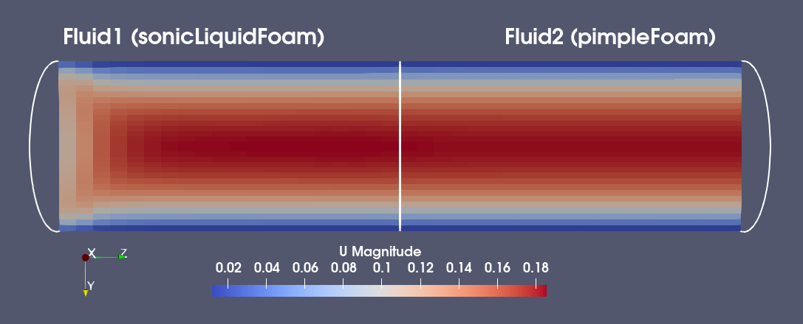
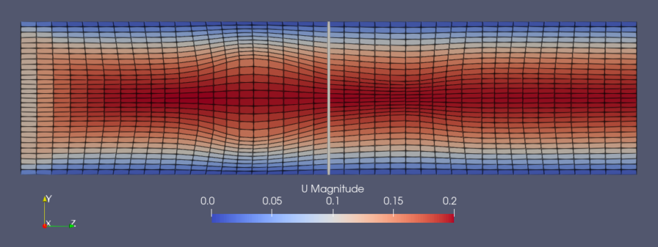


Get the [case files of this tutorial](https://github.com/precice/tutorials/tree/master/partitioned-pipe). Read how in the [tutorials introduction](https://www.precice.org/tutorials.html).


## Setup

This scenario consists of two pipes connected in series, both simulated with OpenFOAM solvers. A fluid enters from the left (here $$ z=0 $$) boundary of the Fluid1 participant with a uniform velocity profile ($$ u_{in} = 0.1 m/s $$) and zero pressure gradient. In its starting, uncoupled state, it exits from the right side (outlet: zero velocity gradient, zero pressure). This is also the coupling interface with Fluid2, which has the same boundary conditions as Fluid1.

On the coupling interface, Fluid1 sends velocity to Fluid2 and receives pressure. Fluid2 uses the [fixedFluxExtrapolatedPressure](https://www.openfoam.com/documentation/guides/v2112/api/classFoam_1_1fixedFluxExtrapolatedPressureFvPatchScalarField.html) boundary condition, which allows a seamless flow continuity across the coupling interface [1]. Not all OpenFOAM solvers support this boundary condition. In such cases, it is recommended to use a fixed Gradient and additionally send the pressure gradient from Fluid1 to Fluid2 for better convergence[2].

## Available solvers

Both for Fluid1 and Fluid2, the following participants are available:

* OpenFOAM (pimpleFoam). An incompressible OpenFOAM solver. For more information, have a look at the [OpenFOAM adapter documentation](https://www.precice.org/adapter-openfoam-overview.html).

* OpenFOAM (sonicLiquidFoam). A compressible OpenFOAM solver. For more information, have a look at the [OpenFOAM adapter documentation](https://www.precice.org/adapter-openfoam-overview.html).

## Running the Simulation

All listed solvers can be used in order to run the simulation. Open two separate terminals and start the desired fluid1 and fluid2 participants by calling the respective run script. For example:

```bash
cd fluid1-openfoam-sonicliquidfoam
./run.sh
```

and

```bash
cd fluid2-openfoam-pimplefoam
./run.sh
```


## Post-processing

The OpenFOAM solvers generate a `.foam` file each. You can open this file in ParaView.
An example of the visualized expected results looks as follows:



Observe that the velocity and pressure values are smoothly changing around the coupling interface.

Note that here we are only coupling sonicLiquidFoam and pimpleFoam only to showcase that they are different solvers working on different domains. In practice, coupling such a compressible and an incompressible solver would not be trivial, due to, e.g., the different pressure units.

Also note that sonicLiquidFoam does not support the fixedFluxExtrapolatedPressure boundary condition. Therefore, when using sonicLiquidFoam for Fluid2, you might want to enable the exchange of the Pressure Gradient and you will observe a less perfect coupling interface.

## Non-Orthogonality

The standard mesh for the pipe is a structured mesh that is orthogonal along the z-axis. It is possible to run the case with an alternative, skewed mesh by using:

```bash
./run.sh skewed
```

The mesh looks like this:


In the end of the simulation, the script runs a post-process utility to calculate the flow rate at the inlet of each participant. Comparing the output for both participants with the skewed mesh, we can observe a loss of mass across the coupling interface. To avoid this problem in cases with non-orthogonal meshes, it is possible to enable *flux corrected velocity in the preCICE FF module* by adding the following option to the ```preciceDict```:

```C
// $fluid1Folder/system/preciceDict

FF
{
    fluxCorrection  true
}
```

Now the mass flux should stay consistent across the coupling interface.

## References

[1]  M. Mühlhäußer: [Partitioned flow simulations with preCICE and OpenFOAM
](https://mediatum.ub.tum.de/node?id=1696254&change_language=en), Master's Thesis, 2022  
[2]  G. Chourdakis, B. Uekermann, G. V. Zwieten, and H. V. Brummelen: [Coupling OpenFOAM to different solvers, physics, models, and dimensions using preCICE](https://mediatum.ub.tum.de/1515271), 14th OpenFOAM Workshop, Duisburg, Germany, submitted (proceedings publication delayed/cancelled), July 2019.


This offering is not approved or endorsed by OpenCFD Limited, producer and distributor of the OpenFOAM software via www.openfoam.com, and owner of the OPENFOAM®  and OpenCFD®  trade marks.

